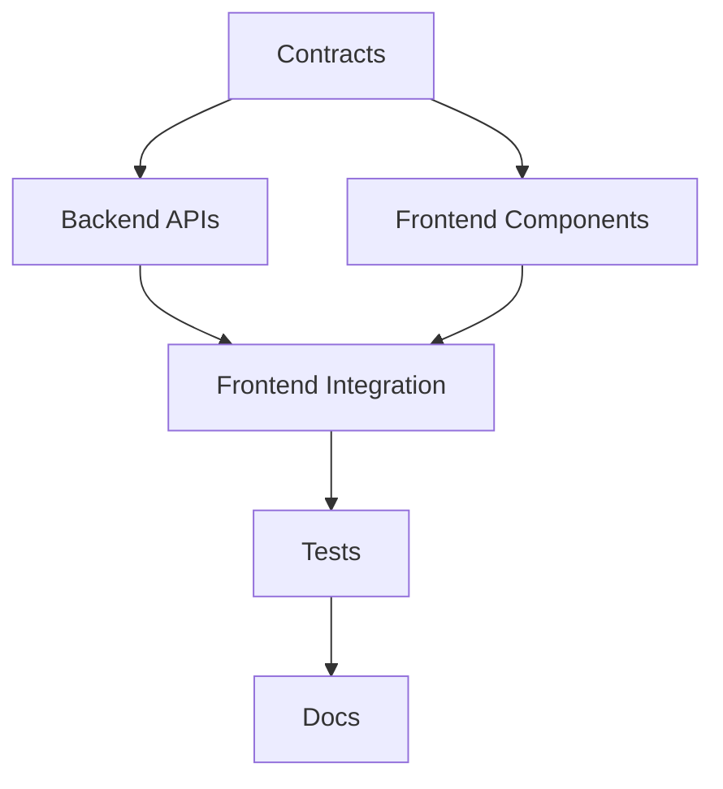

# C. Collision Avoidance Plan

**Status:** MANDATORY
**Date:** 2026-01-01
**Version:** 1.0

---

## 1. Contract Layer

### 1.1 Purpose

The contract layer defines the boundary between Replit's active frontend work and AI agent development. Both parties read from contracts, neither modifies them without explicit agreement.

### 1.2 Contract Files

| Contract File | Purpose | Owner |
|---------------|---------|-------|
| `/shared/contracts/routes.ts` | All route definitions | PM |
| `/shared/contracts/navigation.ts` | Navigation structure | PM |
| `/shared/contracts/api.ts` | API request/response schemas | PM |
| `/shared/contracts/permissions.ts` | Permission matrix | PM |

### 1.3 Contract Rules

```
1. Contracts are READ-ONLY for all development agents
2. Contract changes require Product Lead approval
3. All route additions must go through contracts first
4. API changes must be reflected in contracts before implementation
5. Contracts use TypeScript + Zod for runtime validation
```

### 1.4 Contract Format

```typescript
// /shared/contracts/routes.ts

import { z } from 'zod';

export const RouteDefinition = z.object({
  path: z.string(),
  component: z.string(),
  category: z.enum(['content', 'seo', 'media', 'governance', 'analytics', 'system']),
  permissions: z.array(z.enum(['admin', 'editor', 'author', 'contributor', 'viewer'])),
  status: z.enum(['active', 'deprecated', 'beta']),
});

export const ADMIN_ROUTES: z.infer<typeof RouteDefinition>[] = [
  // All routes defined here - source of truth
];

export const DEPRECATED_ROUTES: { from: string; to: string; until: string }[] = [
  // All redirects defined here
];
```

---

## 2. File Ownership Map

### 2.1 Exclusive Ownership

| File/Directory | Owner | Others |
|----------------|-------|--------|
| `/client/src/App.tsx` | Replit | READ-ONLY |
| `/client/src/components/ui/*` | Replit | DO NOT TOUCH |
| `/client/src/main.tsx` | Replit | DO NOT TOUCH |
| `/client/src/hooks/use-*.tsx` (existing) | Replit | DO NOT TOUCH |
| `/shared/schema.ts` | DBA | DO NOT TOUCH |
| `/server/auth.ts` | Security Lead | DO NOT TOUCH |
| `/server/access-control/*` | Security Lead | DO NOT TOUCH |

### 2.2 Shared Ownership (Coordination Required)

| File | Primary Owner | Secondary | Coordination |
|------|---------------|-----------|--------------|
| `/server/routes.ts` | BACKEND-AGENT-1 | BACKEND-AGENT-2,3 | Section-based |
| `/client/src/routes/*` | FRONTEND-AGENT-1 | Replit | PR review |
| `/client/src/pages/admin/*` | FRONTEND-AGENT-1,2 | Replit | PR review |

### 2.3 AI Agent Exclusive Zones

| Directory | Owner Agent | Purpose |
|-----------|-------------|---------|
| `/client/src/components/admin/review/*` | FRONTEND-AGENT-2 | Review workflow UI |
| `/client/src/components/admin/versions/*` | FRONTEND-AGENT-2 | Version history UI |
| `/client/src/components/admin/navigation/*` | FRONTEND-AGENT-1 | New admin nav |
| `/client/src/pages/admin/content/*` | FRONTEND-AGENT-3 | Content hub |
| `/client/src/pages/admin/seo/*` | FRONTEND-AGENT-3 | SEO hub |
| `/client/src/pages/admin/governance/*` | FRONTEND-AGENT-3 | Governance hub |
| `/server/routes/bulk-operations.ts` | BACKEND-AGENT-2 | Bulk operations |
| `/server/routes/versions.ts` | BACKEND-AGENT-2 | Version API |
| `/server/routes/notifications.ts` | BACKEND-AGENT-3 | Notifications API |
| `/server/middleware/audit.ts` | BACKEND-AGENT-1 | Audit logging |
| `/server/middleware/protection.ts` | BACKEND-AGENT-3 | Protection levels |
| `/server/services/review-workflow.ts` | BACKEND-AGENT-1 | Review workflow |

---

## 3. Merge Sequencing Rules

### 3.1 Merge Order Priority

```
Priority 1: Contract changes (must be approved by PM)
Priority 2: Schema changes (must be approved by DBA)
Priority 3: Backend API additions
Priority 4: Backend service implementations
Priority 5: Frontend components (new files)
Priority 6: Frontend page integrations
Priority 7: Test additions
Priority 8: Documentation updates
```

### 3.2 Sequential Dependencies



### 3.3 Conflict Resolution Protocol

| Scenario | Resolution |
|----------|------------|
| Two agents touch same file | Earlier branch by timestamp has priority |
| Import conflict | Resolve alphabetically, newer agent rebases |
| Component naming conflict | Check contracts, first defined wins |
| Route path conflict | Check contracts, first defined wins |

### 3.4 Merge Window Schedule

```
Daily merge windows:
- 09:00-10:00 UTC: Backend merges (Priority 3-4)
- 14:00-15:00 UTC: Frontend merges (Priority 5-6)
- 18:00-19:00 UTC: Tests/Docs merges (Priority 7-8)

Contract/Schema merges: Ad-hoc with approval
```

---

## 4. Replit Coordination Protocol

### 4.1 Replit Active Zones

| Zone | Status | AI Agent Action |
|------|--------|-----------------|
| `/client/src/App.tsx` | Active | DO NOT MODIFY |
| `/client/src/components/ui/*` | Active | DO NOT MODIFY |
| `/client/src/main.tsx` | Active | DO NOT MODIFY |
| `/client/src/lib/utils.ts` | Active | READ ONLY |
| `/client/src/hooks/*` (existing) | Active | READ ONLY |

### 4.2 Communication Trigger

Before any AI agent starts work that might impact Replit zones:

```
1. Check file ownership map above
2. If file is in Replit zone → STOP
3. If file imports from Replit zone → CREATE NEW FILE instead
4. If unsure → Ask FRONTEND-AGENT-1 to verify
```

### 4.3 Safe Integration Points

| Integration Point | How to Use |
|-------------------|------------|
| New admin pages | Create in `/client/src/pages/admin/[category]/` |
| New admin components | Create in `/client/src/components/admin/[feature]/` |
| New routes | Define in contracts, implement as new files |
| New hooks | Create in `/client/src/hooks/admin/` (new dir) |
| New utilities | Create in `/client/src/lib/admin/` (new dir) |

### 4.4 Import Strategy

```typescript
// CORRECT: Import from shadcn (Replit-managed)
import { Button } from "@/components/ui/button";

// CORRECT: Create new component in admin dir
// /client/src/components/admin/review/ReviewButton.tsx
export function ReviewButton() { ... }

// WRONG: Modify shadcn component
// /client/src/components/ui/button.tsx ← DO NOT TOUCH
```

---

## 5. Pre-Merge Checklist

Before every PR merge:

```markdown
## Collision Prevention Checklist

- [ ] No changes to files in Replit Active Zones
- [ ] No changes to FROZEN assets without approval
- [ ] All new files are in AI Agent Exclusive Zones
- [ ] Imports from UI components are read-only usage
- [ ] Contracts are read-only (not modified without approval)
- [ ] Branch is rebased on latest main
- [ ] No TypeScript import conflicts
- [ ] Component names don't conflict with existing
```

---

## 6. File Lock Announcement Format

When an agent starts work:

```
LOCK ACQUIRED
Agent: BACKEND-AGENT-1
Task: PM-001
Files:
- /server/middleware/audit.ts (CREATE)
- /server/routes.ts (MODIFY: lines 500-600)
Duration: 4 hours
Start: 2026-01-02 09:00 UTC
```

When an agent finishes:

```
LOCK RELEASED
Agent: BACKEND-AGENT-1
Task: PM-001
Status: PR #123 ready for review
```

---

## 7. Emergency Conflict Resolution

If a merge conflict occurs on `main`:

```
1. HALT all merges immediately
2. Identify conflicting commits
3. Earlier commit by timestamp is authoritative
4. Later commit must rebase and re-test
5. Notify all agents of blocked merge window
6. Resume after conflict resolved
```

---

## 8. Daily Sync Format

```markdown
# Daily Sync - [DATE]

## Active Work
| Agent | Task | Files Locked | ETA |
|-------|------|--------------|-----|
| ... | ... | ... | ... |

## Completed Today
| Agent | Task | PR | Merged |
|-------|------|-----|--------|
| ... | ... | ... | ... |

## Blocked
| Agent | Task | Blocker | Resolution |
|-------|------|---------|------------|
| ... | ... | ... | ... |

## Replit Status
- Last known activity: [DATE/TIME]
- Active zones: [LIST]
- Any upcoming changes: [Y/N + details]
```
